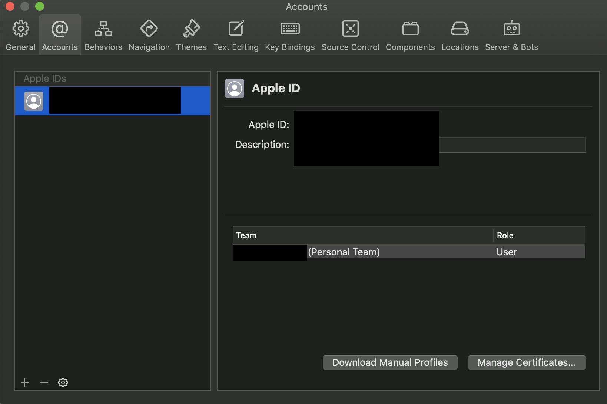
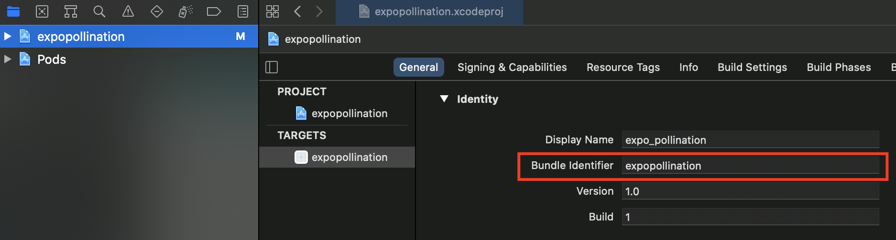
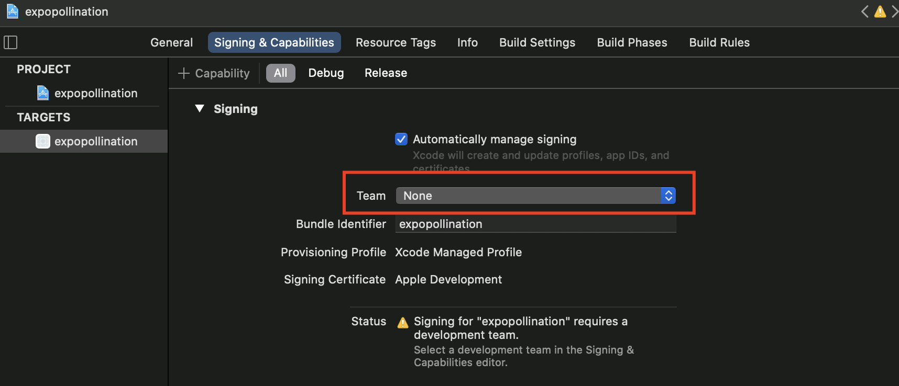

## Overview

In this tutorial you will:

* clone the Pollination mobile app GitHub repository
* install required dependencies and packages
* setup Xcode to build the project
* install the Pollination iOS app onto your device or simulator

## Requirements

To successfully complete this tutorial you need:

* a macOS machine with Xcode installed
* an Apple ID or Apple developer account
* an iOS device
* NodeJS and npm installed 
  * Info: https://nodejs.org/en/download/package-manager/

## Command Line Setup

1. Clone the GitHub repository from:
   
   https://github.com/bcit-pollination/mobile_pollination

2. Navigate to the root of the project.

  ```shell
  cd mobile_pollination
  ```

3. Install the required NodeJS dependencies.

  ```shell
  npm install
  ```

4. Install the React Native CLI.

  ```shell
  npm install -g react-native-cli
  ```

5. Navigate to the ios folder of the project.

  ```shell
  cd ios
  ```

6. Install the required dependencies.

  ```shell
  pod install && pod update
  ```

## Xcode Setup

1. Launch Xcode.

2. Go to Preferences > Accounts and click the "+" at the bottom to add your Apple ID/Developer account.

  

3. Create a Personal Team and click "Manage Certificates" > "+" > "Apple Development" to create a development certificate.

4. Locate the "expopollination.xcworkspace" located in the project's "ios" folder and open it in Xcode.

5. Click on the "expopollination" project on the left sidebar.

6. Click on the "General" tab.

7. Change the "Bundle Identifier" name to any name you like (e.g. "expopollination").

  

8. Click on the "Signing & Capabilities" tab.

9. Choose your Personal Team from the "Team" dropdown.

  

## Running the Project on an iOS Device.

1. Navigate to the root folder of the project.

2. Plug in your iOS device into your macOS device via USB.

3. Install the required ios-deploy library.

  ```shell
  npm install -g ios-deploy
  ```
  or
    ```shell
  brew install ios-deploy
  ```

4. Launch the project on your iOS device.

  ```shell
  react-native run-ios --device="Device Name"
  ```

## Running the Project on an iOS Simulator

:::note
  Bluetooth functions are not available on a simulator.
:::

1. Navigate to the root folder of the project.

2. Launch the project on the simulator.

  ```shell
  react-native run-ios
  ```
  or
  ```shell
  react-native run-ios --simulator="Simulator Name"
  ```

## Troubleshooting

#### "Untrusted Developer" Error When Launching App on iOS Device

1. On your device, go to Settings > General > Profiles/Device Management.

2. Choose your Apple Development account under "Developer App".

3. Click "Trust".

#### Finding Your iOS Device's Name

1. On your device, go to Settings > General > About > Name.
