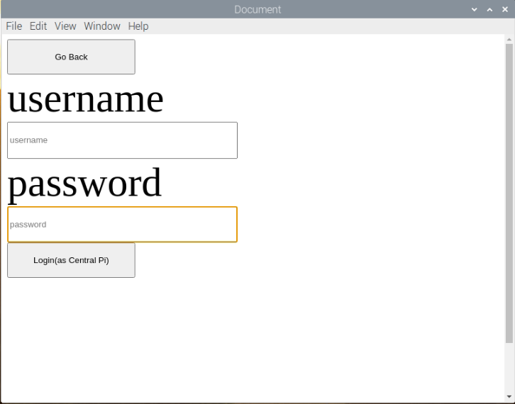

## Overview

In this tutorial you will:

- clone the Pollination Voting Station for Raspberri Pi (RPI) GitHub repository,
- install required dependencies and packages, and
- build and run the Pollination Voting Station application on your RPI with Electron, MongoDB.

## Requirements

To successfully complete this tutorial you will need:

- a USB with enough space,
- a Raspberry Pi with:
  - Raspbian OS
  - Bluetooth
  - Node js version <b>8.9.4</b>
  - Mongo version <b>2.4.14</b>
  - Python 3
- a touchscreen (<i>optional</i>).

## Setup

### 1. Installing MongoDB

1. Update your machine

```shell
sudo apt update
sudo apt upgrade
```

2. Begin the installation

```shell
sudo apt install mongodb
```

3. Check the installed MongoDB version

```shell
mongo --version
```

:::note Note
Make sure the version is <b>2.4.14.</b>
:::

### 2. Installing Node JS

1. To download and install newest version of Node.js, use the following command

```shell
curl -sL https://deb.nodesource.com/setup_8.x | sudo -E bash -
```

2. Begin the installation

```shell
sudo apt-get install -y nodejs
```

3. Check the installed Node.js version

```shell
node -v
```

:::note Note
Make sure the version is <b>8.9.4.</b>
:::

### 3. Setting up your Bluetooth

Enter the following commands to set up your Raspberry Pi's Bluetooth

```shell
sudo service bluetooth stop
sudo update-rc.d bluetooth remove
sudo systemctl stop bluetooth
sudo systemctl disable bluetooth
sudo apt-get install bluetooth bluez libbluetooth-dev libudev-dev
```

:::important Important
At this stage, please <b>restart</b> your RPI
:::

:::important Important
Once restarted, make sure that your Bluetooth is turned <b>on</b>.
:::

## Getting Started

### 1. Cloning the project

1. Choose a directory of your choosing and clone the project at https://github.com/bcit-pollination/voting_station_pollination.git onto your Raspbian

```shell
git clone https://github.com/bcit-pollination/voting_station_pollination.git
```

2. Navigate to the root directory of the project

```shell
cd voting_station_pollination/
```

3. Install the required dependencies

```shell
npm install
pip install cryptography
```

4. Check your mongoose version.

```shell
npm list | grep "mongoose"
```

:::note Note
Make sure the version is <b>2.9.10.</b>
:::

### 2. Running the Electron Application

1. From the root directory, navigate to the touchingscreen_electron folder

```shell
cd touchingscreen_electron
```

2. Run the program

```shell
npm start
```

#### Run Control Server

1. Click on <b>"Run Control Server"</b>.

   

2. Log in with the credentials and click <b>"Login"</b>.

   

3. After you are done logging in, click on <b>“Get Election List”</b>.

   The application will generate the current Election List that the logged in organization have.

## Troubleshooting

### Incorrect Node JS version

If required Upgrading or Downgrading, please follow the steps inside https://www.surrealcms.com/blog/how-to-upgrade-or-downgrade-nodejs-using-npm.html to do so
