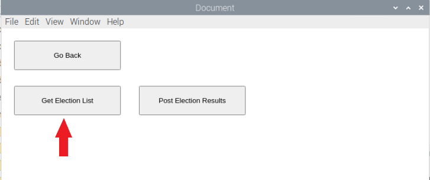
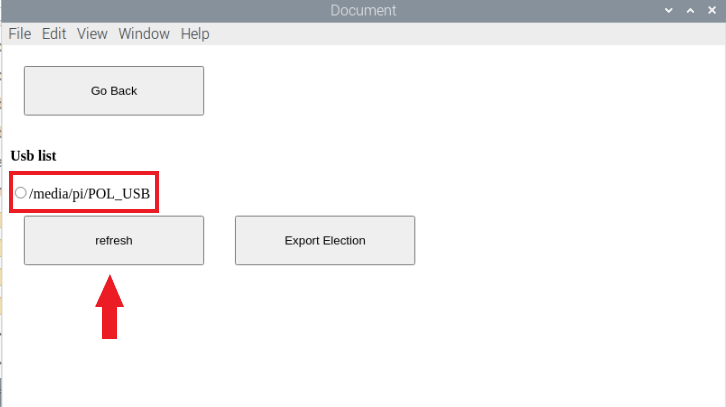
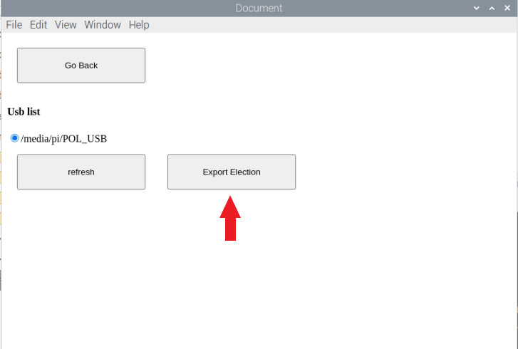

## Overview

In this tutorial you will:

- Install MongoDB
- Install NodeJS
- Prepare your RPI voting station to use bluetooth
- Install the RPI voting station software
- Understand how to use the RPI voting station software


## Requirements

To successfully complete this tutorial you will need:

- a USB with enough space and a name without spaces (ex: "USB", not "U SB"),
- a Raspberry Pi with:
  - Raspbian OS
  - Bluetooth
  - Node js version <b>8.9.4</b>
  - Mongo version <b>2.4.14</b>
  - Python 3
- a touchscreen (<i>optional</i>).
## Procedures

### Install MongoDB

1. Update your machine

```shell
sudo apt update
sudo apt upgrade
```

2. Begin the installation

```shell
sudo apt install mongodb
```

3. Check the installed MongoDB version

```shell
mongo --version
```

:::note Note
Make sure the version is <b>2.4.14.</b>
:::

4. Navigate to the root folder of your system.

```shell
cd /
```

5. Create a <b>data/db/</b> directory.

```shell
sudo mkdir data/db/
```

6. Start MongoDB service.

```shell
sudo service mongodb start
```

7. Confirm a <b>mongod.lock</b> file was created inside <b>data/db/</b>.

```shell
cd data/db
```

```shell
ls
```


8. Check for MongoDB connections.

```shell
sudo mongod
```

9. Enter the MongoDB shell and connect to the database.

```shell
mongo
```


### Install Node JS

1. To download and install newest version of Node.js, use the following command

```shell
curl -sL https://deb.nodesource.com/setup_8.x | sudo -E bash -
```

2. Begin the installation

```shell
sudo apt-get install -y nodejs
```

3. Check the installed Node.js version

```shell
node -v
```

:::note Note
Make sure the version is <b>8.9.4.</b>
:::

### Prepare RPI voting station to use bluetooth

Enter the following commands to set up your Raspberry Pi's Bluetooth

```shell
sudo service bluetooth stop
sudo update-rc.d bluetooth remove
sudo systemctl stop bluetooth
sudo systemctl disable bluetooth
sudo apt-get install bluetooth bluez libbluetooth-dev libudev-dev
```

:::important Important
At this stage, please <b>restart</b> your RPI
:::

:::important Important
Once restarted, make sure that your Bluetooth is turned <b>on</b>.
:::

### Install the RPI voting station software

1. Choose a directory of your choosing and clone the project at https://github.com/bcit-pollination/voting_station_pollination.git onto your Raspbian

```shell
git clone https://github.com/bcit-pollination/voting_station_pollination.git
```

2. Navigate to the root directory of the project

```shell
cd voting_station_pollination/
```

3. Install the required dependencies

```shell
npm install
pip install cryptography
```

4. Check your mongoose version.

```shell
npm list | grep "mongoose"
```

:::note Note
Make sure the version is <b>2.9.10.</b>
:::

### How to use the RPI voting station software

#### Running the graphical interface

1. From the root directory, navigate to the touchscreen_electron folder

```shell
cd touchscreen_electron
```

2. Run the program

```shell
npm start
```

#### Run Control Server

1. Click on <b>"Run Control Server"</b>.

   

2. Log in with the credentials and click <b>"Login"</b>.

   

3. After you are done logging in, click on <b>“Get Election List”</b>.

   

   The application will generate the current Election List that the logged in organization has.

4. Click on <b>"Download Election Package"</b>.

   

   The <b>"Usb List"</b> section will be displayed.

   

5. Plug your USB into the Raspberry Pi.

6. Click on <b>"Refresh"</b> to have your USB path showed in the application.

   

7. Click on the USB path of your choosing to have the <i>Election Data</i> exported to.

8. Click on <b>"Export Election Data"</b>.

   

9. At this moment, you will see the Encoded Election Data exported to the root of your USB's root directory

   

10. Open another terminal and enter the MongoDB shell to switch to the Pollination database.

   ```shell
   mongo
   ```

   ```shell
   use pollination
   ```

11. Go back to the <b>Navigation Page</b>.

   

#### Run Voting Server

1. Click on <b>"Run Voting Server"</b>.

2. Log in with the credentials and click <b>"Login(as Voting Pi)"</b>.

3. Enter a location and click <b>"Submit"</b>.

4. Click on <b>"Refresh"</b> to have your USB path showed in the application.

5. Choose your USB with the exported Election Data saved on it.

6. Click on <b>"Import Election Data"</b>.

7. Click <b>"Start BLE Server"</b> to start the voting server. 

Now, users will be able to vote on the Raspberry Pi touchscreen or connect to the Raspberry Pi on their mobile devices via Bluetooth. 

:::tip
For instructions on installing the iOS app: [iOS Instructions](../mobile_app/ios.md)

For instructions on installing the Android app: [Android Instructions](../mobile_app/android.md)
:::

## Troubleshooting

### Incorrect Node JS version

If required Upgrading or Downgrading, please follow the steps inside https://www.surrealcms.com/blog/how-to-upgrade-or-downgrade-nodejs-using-npm.html to do so
