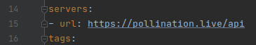

## Overview

In this tutorial you will:
1. Install python 3.9
1. Create a virtual environment and learn how to activate and deactivate it
1. Clone the web server repository and install requirements
1. Get sendgrid API key
1. export environment variables
1. Configure the connection to the MySQL server
1. Configure URL
1. Run the web server

## Requirements

To successfully complete this tutorial you need:
* Unused 8080 port
* Common knowledge on the use of Github and Git
* Sendgrid account and API key with the rights to send email
* MySQL database has been setup

## Procedures

### Install Python 3.9

1. ensure you are at the home directory
   ```shell
      cd ~
    ```
1. Add Python repo
    ```shell
    sudo add-apt-repository ppa:deadsnakes/ppa
    ```
   
1. Update repo information
    ```shell
    sudo apt update
    ```
   
1. Install python
    ```shell
    sudo apt install python3.9 python3.9-distutils python3.9-venv python3.9-dev
    ```
1. Install pip
    ```shell
      curl https://bootstrap.pypa.io/get-pip.py -o get-pip.py
      python3.9 get-pip.py
      sudo ln -s /home/ubuntu/.local/bin/pip3.9 /usr/bin/pip
    ```

:::note
    The pip command may be installed in a different folder. You may have to look at the output
of python3.9 get-pip.py to asses if this is the case. To confirm proper installation do pip --version
:::

You have now correctly installed python

### Create a virtual env

1. Create a folder for your virtual environment
    ```shell
    mkdir python_venvs
    cd python_venvs
    ```

1. Create a virtual environment
    ```shell
    python3.9 -m venv <your domain name here>
    ```

#### Virtual environment actions

* Activate venv. You should be in the python_venvs directory
    ```shell
    source source karelc.com/bin/activate
    ```

* Deactivate venv
    ```shell
    deactivate
    ```

### Clone repository and install requirements

1. Fork this repository
   https://github.com/bcit-pollination/web_server_pollination

1. Ensure you are at the home directory
   ```shell
      cd ~
    ```

1. Clone your fork
   ```shell
    git clone <your fork clone link here>
    ```

1. Enter the server directory
    ```shell
    cd web_server_pollination/server
    ```
1. activate venv (see previous procedure)
   
1. Install python required modules
    ```shell
    pip install -r requirements.txt 
    ```

1. Install the mysql connector
    ```shell
    sudo apt get default-libmysqlclient-dev build-essential
    pip install mysqlclient
    ```
   
1. Install swagger UI to show the api documentation
    ```shell
     pip install connexion[swagger-ui]
    ```

### Export environment variables

1. activate venv 
   
1. Ensure you are at the home directory
   ```shell
      cd ~
    ```

1. Create a script that exports the environment variables
   ```shell
      touch secrets_exporter.sh
      chmod +x secrets_exporter.sh
    ```
   
1. Copy paste the following into the file:
        
        export AUTH_SECRET=<your chosen secret here>
        export MAIL_SECRET=<your chosen secret here>
        export SENDGRID_API_KEY=<sendgrid's api key here>
        export POLLINATION_URL=<your domain here>
:::tip
use this to open the file
```shell
   nano secrets_exporter.sh
 ```
:::
   
:::note
Each of the secrets should be at least 32 characters long, alpha-numeric
:::

1. Execute the file
   ```shell
      . ./secrets_exporter.sh
    ```
:::caution
Note the dot
:::


### Configure the connection to MySQL

1. Create configuration file
   ```shell
   touch ~/.my.cnf
   ```

1. Add config file contents


      [client]
      port=3306
      host=localhost
      database="voting_system"
      user=server
      password="<your MySQL user password here>"
   
      [mysql]
      port=3306
      host=localhost
      database="voting_system"
      user=server
      password="<your MySQL user password here>"
      
      [mysqldump]
      user=server
      password="<your MySQL user password here>"

:::tip
use this to open the file
```shell
   nano ~/.my.cnf
 ```
:::


### Configure URL

1. Open the swagger API
   ```shell
   nano ~/web_server_pollination/server/swagger_server/swagger/swagger.yaml
   ```

1. Substitute in your domain name in line 15
   
   
   Line 15 should now read:
      - url: https://<your domain here>/api
   

You may then close the file

1. Open the organization controller
    ```shell
   nano ~/web_server_pollination/server/src/endpoint
   ```


### Run the server

1. activate venv 

1. Move into the server directory
   ```shell
      cd ~/web_server_pollination/server
    ```
   
1. Run the server
   ```shell
      python -m swagger_server
    ```

1. Verify that the server is running by navigating in a browser to 


      https://<your domain name>/api/ui